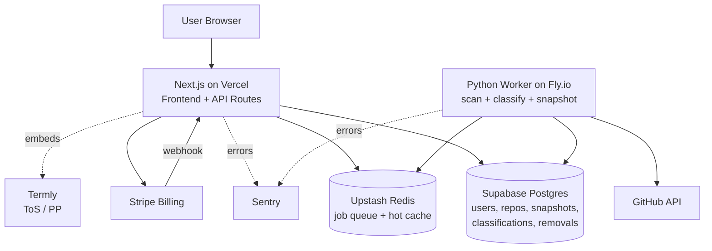
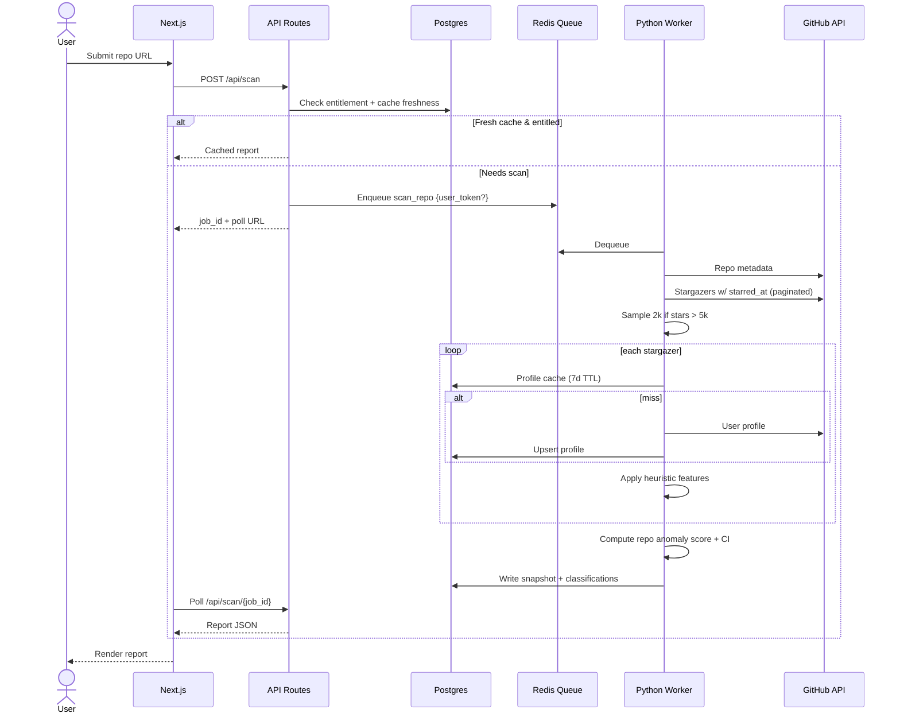
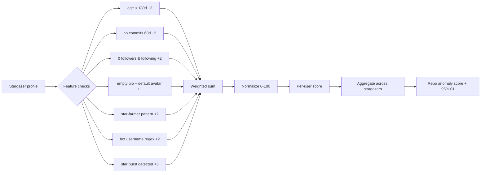

# To Catch A Bot Repo (TCABR) — Design

**Status:** Draft
**Date:** 2026-04-16
**Owner:** Solo build
**Stance:** B — Hedged framing. Anomaly scores and "atypical profile" labels, never "bot %." Prominent disclaimer. Investigative-analytics, not accusatory.

## 1. Product summary

An investigative-analytics SaaS that ingests any public GitHub repo and produces a shareable "anomaly report" on its stargazers. Surfaces statistical signals (not accusations) that a repo's star growth is atypical. Includes a public leaderboard of "most suspicious growth" and "cleanest organic growth" among trending repos. Solo-built, launched with a hedged/satirical framing, gated by a GitHub-OAuth + Stripe paywall.

## 2. Personas & jobs-to-be-done

- **HN lurker (primary virality driver)** — wants a fun, shareable take on which trending repos look sus.
- **VC analyst** — needs a quick-look signal during due diligence. Will pay.
- **Dev investigating a rival / suspicious repo** — one-off searches. Conversion target for Pro.

## 3. Scope

### MVP (launch)

- On-demand single-repo report (sampled scan, anomaly score, feature breakdown, star time-series chart, stargazer profile gallery).
- Public leaderboard (two lists: "most suspicious" and "cleanest organic"), nightly refresh.
- GitHub OAuth sign-in (required for Pro; anonymous search allowed at free-tier limits).
- Stripe paywall (Free vs Pro $20/mo, $14 launch promo).
- About / ToS / Privacy pages (Termly-generated + custom About).
- Removal-request flow for individual profiles.
- Default-obscured usernames; reveal-on-hover for Pro.
- LLC + disclaimer copy.

### Phase 2 (post-launch TODOs, tracked as issues)

- Full-scan opt-in for Pro users on large repos (async, "report ready in N hours").
- Watchlist + email alerts on anomaly-score changes.
- CSV export.
- Team tier ($50/mo, 5 seats, API + webhooks).
- ML clustering on accumulated data to find behavioral bot clusters.
- **Regression analysis on classifier features** — periodically re-validate which heuristics still discriminate bots vs humans as GitHub account patterns evolve.
- Public API access.
- Slack notifications.

## 4. Architecture



## 5. Scan data flow



## 6. Data model (ERD)

```mermaid
erDiagram
    USER ||--o{ SEARCH : performs
    USER ||--o| SUBSCRIPTION : has
    USER ||--o{ WATCHLIST : owns
    REPO ||--o{ REPO_SNAPSHOT : has
    REPO ||--o{ SEARCH : scanned_in
    REPO ||--o{ WATCHLIST : in
    REPO_SNAPSHOT ||--o{ STARGAZER_CLASSIFICATION : contains
    STARGAZER_PROFILE ||--o{ STARGAZER_CLASSIFICATION : classified_as
    STARGAZER_PROFILE ||--o{ REMOVAL_REQUEST : subject_of

    USER { uuid id PK; text email; text gh_username; text gh_token_encrypted; timestamp created_at }
    SUBSCRIPTION { uuid user_id PK; text stripe_customer_id; text tier; timestamp period_end }
    REPO { uuid id PK; text owner; text name; int star_count; timestamp last_scanned_at }
    REPO_SNAPSHOT { uuid id PK; uuid repo_id FK; int anomaly_score; int sample_size; int stargazer_total; jsonb feature_breakdown; jsonb star_timeseries; timestamp created_at }
    STARGAZER_PROFILE { text username PK; timestamp joined_at; int followers; int following; int public_repos; int recent_commits_60d; jsonb raw; timestamp cached_at }
    STARGAZER_CLASSIFICATION { uuid snapshot_id FK; text username FK; int anomaly_score; jsonb feature_hits; timestamp starred_at }
    SEARCH { uuid id PK; uuid user_id FK; uuid repo_id FK; timestamp created_at }
    WATCHLIST { uuid user_id FK; uuid repo_id FK; timestamp added_at }
    REMOVAL_REQUEST { uuid id PK; text gh_username; text contact_email; text reason; text status; timestamp created_at }
```

## 7. Scoring pipeline



Weights live in a config table and are surfaced transparently in the UI — every anomaly score shows which features contributed. This transparency is the legal armor: "we are not calling them bots, we are showing which public features their profile has."

### Feature definitions (v1)

| Feature | Definition | Weight |
|---|---|---|
| `new_account` | `created_at` within rolling 180 days | +3 |
| `no_recent_commits` | 0 public push events in last 60 days | +2 |
| `zero_social` | followers == 0 AND following == 0 | +2 |
| `sparse_profile` | empty bio AND default avatar | +1 |
| `star_farmer` | >50 stars, starred>10x more than own public repos, stars clustered in bursts | +2 |
| `bot_username` | matches `^[a-z]+-[a-z]+-\d{3,}$` or similar regex set | +2 |
| `star_burst` | user's star on target repo falls within a repo-level burst window (statistical outlier in stars/hour) | +3 |

Max per-user raw score = 15; normalized to 0–100. Repo-level anomaly score = mean(per-user normalized) with 95% bootstrap CI, reported with sample size.

## 8. Key design decisions (rationale)

- **API-only, no scraping** → clean GitHub ToS posture. `starred_at` timestamps from the star-event API give historical velocity free on first scan.
- **OAuth rate-limit pooling** → Pro users use their own 5k/hr quota. A small fallback token pool covers anonymous/free.
- **Sampling default, full-scan premium** → A random sample of 2,000 stargazers gives tight CIs on percentage metrics. Full scan is a Pro opt-in.
- **Heuristics > ML for v1** → Explainable, shippable, defensible. ML clustering is Phase 2 once accumulated data supports it.
- **Transparent feature weights** → "Here is what was flagged" beats "our model says" both legally and in UX.
- **Username obfuscation by default** → reduces doxxing exposure. Pro reveal is a conscious user action; ToS acknowledges.
- **Leaderboard has both lists** → "Cleanest organic growth" is PR armor and serves the VC audience genuinely.

## 9. Full-stack requirements

| Layer | Service | Cost (MVP) |
|---|---|---|
| Frontend hosting | Vercel (Next.js, Hobby → Pro) | $0 → $20/mo |
| DB + Auth + Storage | Supabase (Free → Pro) | $0 → $25/mo |
| Queue + hot cache | Upstash Redis (pay-per-req) | ~$5/mo |
| Worker runtime | Fly.io or Railway (Python) | ~$5–10/mo |
| Payments | Stripe | 2.9% + 30¢ per txn |
| Errors | Sentry (free tier) | $0 |
| Analytics | Plausible or PostHog | $9–14/mo |
| Legal docs | Termly | $10/mo |
| Domain | tocatchabotrepo.com (or similar) | ~$12/yr |
| Entity | Single-member LLC | ~$300–500 one-time + annual fee |
| Registered agent | Northwest / similar | $50–150/yr |

**Baseline operating cost:** ~$60–90/mo + one-time LLC setup. Breakeven ≈ 5 paid Pro users.

## 10. Tech stack

- **Monorepo (pnpm workspaces + Turborepo):**
  - `apps/web` — Next.js 15 App Router, React 19, Tailwind, shadcn/ui, Recharts for time-series.
  - `apps/worker` — Python 3.12, FastAPI (health/admin), `httpx`, `arq` or `rq` for job workers, `pydantic` for models.
  - `packages/shared` — TS types, zod schemas, feature-weight config (JSON source of truth, consumed by both TS and Python).
- **Auth:** Supabase Auth with GitHub OAuth (scopes: `read:user`, `public_repo`).
- **Payments:** Stripe Checkout + Customer Portal; webhooks → Next.js route handler.
- **Encryption:** GitHub tokens encrypted at rest via Supabase Vault or `pgcrypto`.
- **Observability:** Sentry in both apps; structured logs to Axiom or Logtail.
- **CI/CD:** GitHub Actions → Vercel auto-deploy web; Fly.io deploy on main for worker.

## 11. UX surface

1. **Landing (`/`)** — hero: "Is this repo's growth organic?" Single search input. Below: live leaderboard preview.
2. **Report (`/r/:owner/:name`)** — anomaly score hero (big number + CI), feature breakdown bar chart, star-velocity time-series, stargazer gallery (obscured for free, revealed for Pro), share button.
3. **Leaderboard (`/leaderboard`)** — two-column: Most Suspicious / Cleanest. Filters by language, date range, min-stars.
4. **Account (`/account`)** — subscription, watchlist, API key (Phase 2).
5. **About (`/about`)** — custom copy: "This is investigative analysis of public GitHub data. Scores are statistical signals, not verdicts." Explains methodology and weights openly.
6. **ToS / Privacy (`/terms`, `/privacy`)** — Termly-embedded.
7. **Request removal (`/removal`)** — form for individuals to exclude their profile.

## 12. Pricing

- **Free:** 1 search/day, 24h-lagged cache, leaderboard view only (no profile reveals).
- **Pro $20/mo** (launch promo $14/mo = 30% off): unlimited searches, fresh scans, profile reveals, watchlist.
- **Team $50/mo (Phase 2):** 5 seats, API, webhooks.
- Annual: 2 months free (~17% off).

## 13. Testing & launch plan

- **Unit:** feature classifiers (Python, pytest) with golden-profile fixtures.
- **Integration:** scan-job e2e against recorded GitHub responses (`vcrpy`).
- **Smoke:** Playwright on Next.js for paywall gate, search, leaderboard render.
- **Pre-launch:** scan 20 well-known repos by hand, manually sanity-check top-ranked "suspicious" users, tune weights, freeze v1 config.
- **Launch day:** HN + X post linking to a juicy leaderboard entry. Removal-request form live and monitored.

## 14. Risks & mitigations

| Risk | Mitigation |
|---|---|
| Defamation suit | LLC, hedged framing, transparent features, removal flow, username obfuscation, Termly ToS with indemnification + no-warranty |
| GitHub rate limiting kills UX | OAuth pooling, sampling, 7-day profile cache, nightly pre-compute for leaderboard |
| GitHub ToS change banning this use | API-only, attributable scans via user tokens, removal mechanism |
| Stripe objects to product framing | Frame as "analytics" not "bot detection"; Paddle as contingency |
| Doxxing / harassment of operator | LLC as public-facing entity, domain privacy, registered agent, no personal contact info |
| Misclassified "clean" repo → bad press | Prominent disclaimer, transparent weights, "suggest correction" button, manual review queue |

## 15. Open questions / TODOs

- Final brand/domain acquisition (working name: **To Catch A Bot Repo** / TCABR).
- Exact Termly-generated doc revisions for satirical-analytics positioning.
- Choice of US state for LLC formation (Wyoming vs Delaware vs home state).
- Weight calibration against a hand-labeled set before launch.
- Final leaderboard refresh cadence (nightly vs 6-hourly).

## 16. Research-derived additions (2026-04-21)

Sourced from two external reads:
- Quira, *Developer reputation in the era of LLMs* (DevRank / PageRank over the GitHub graph).
- Awesome Agents, *GitHub fake-stars investigation* (echoes StarScout @ CMU/NC State/Socket, 20 TB / 6.7 B events / 18,617 repos flagged).

### 16.1 New per-stargazer features (candidates for v1.1 config)

| Feature | Definition | Proposed weight | Notes |
|---|---|---|---|
| `zero_public_repos` | `public_repos == 0` | +2 | Organic baseline ~5%, suspicious cohorts 28–39%. Distinct from `zero_social`. |
| `ghost_account` | `zero_social` AND `zero_public_repos` AND empty bio AND default avatar | +3 | Organic ~1%, suspicious 19–29%. Composite signal — should *replace* single-point bonus when it fires so we don't double-count. |
| `account_age_median_bucket` | account age < 1,200 days (≈3.3 yr) | +1 | Per-stargazer. Lighter than the existing <180d hard flag, captures broader "young cohort" pattern (suspicious cohort median 997–1,180 d vs organic 2,800–4,800 d). |

### 16.2 New repo-level signals (aggregate over the stargazer sample, not per-user)

Awesome Agents' "organic" table is entirely repo-aggregate. We currently output a repo anomaly score by averaging per-user scores; we should also surface **repo-level structural ratios** that don't depend on stargazer enrichment (cheap, computable from public repo metadata alone):

| Signal | Organic baseline | Suspicious cutoff | Where it lands |
|---|---|---|---|
| `fork_to_star_ratio` | ~0.160 | `< 0.050` | Top-level repo metric; shown on report hero alongside anomaly score. |
| `watcher_to_star_ratio` | 0.005–0.030 | `< 0.001` | Same as above. |
| `pct_zero_repo_stargazers` | ~5% | `≥ 25%` | Derived from sample. |
| `pct_zero_follower_stargazers` | 5–12% | `≥ 50%` | Derived from sample. |
| `pct_ghost_stargazers` | ~1% | `≥ 15%` | Derived from sample. |
| `median_stargazer_account_age_days` | 2,800–4,800 | `< 1,500` | Derived from sample. |

These go into a new `feature_breakdown.repo_level` block on the snapshot and a second row on the report page.

### 16.3 DevRank / network-topology signal (Phase 2)

Quira's DevRank applies PageRank over a tripartite graph:
1. Developer → Repo (star edges)
2. Repo → Developer (commit edges)
3. Repo → Repo (dependency/import edges)

For our use case, we only need the first two. Proposed additions:

- **Per-stargazer `devrank_percentile`** — precomputed offline from a periodic graph snapshot; the top 1% and top 10% fractions among a repo's stargazers become a "social proof" signal opposite to the anomaly score.
- **Leaderboard companion column** — "% of stargazers in DevRank top 10%." High for truly organic breakout repos (LangChain, PyTorch), near-zero for farm-boosted.
- **Gating:** PageRank over the full GitHub network is expensive; MVP can instead use a cheap proxy — median(contributor followers) or median(stargazer public-repos count). Full DevRank is a Phase-2 research track.

### 16.4 Cross-validation against StarScout

CMU's StarScout has a published flagged list (90.42% of their flagged repos were subsequently deleted by GitHub — strong ground truth). TODOs:

- Obtain the StarScout public dataset (paper appendix or Socket blog).
- Add an admin-only `/admin/starscout-overlap` page that reports: of repos we score >threshold, what fraction appear in StarScout? Inverse too.
- Use overlap as a weight-calibration signal (replaces or augments the hand-labeled set mentioned in §15).

### 16.5 Category-bias guard

Quira flags "educational / first-contribution" repos as legitimately inflating star counts in ways that distort reputation metrics. We should:

- Add a `repo_category` tag (detected via topics/README heuristics: tutorial, awesome-list, first-contribution, dotfiles).
- On the report, down-weight or explicitly caveat the anomaly score for these categories — the same new-account fraction is expected for a beginner-friendly repo.
- On the leaderboard, exclude educational categories from the "most suspicious" list by default, with a toggle.

### 16.6 Reverse-engineering known botting tooling

Three open-source "star/commit botting" tools are known public references. For each we want to (a) understand the generated fingerprint so we can detect its output, and (b) scan the tool's own stargazers, since they are disproportionately likely to be bot operators or bot-controlled accounts (a self-labeled dataset).

**Tools to investigate:**

- **fake-git-history** (github.com/artiebits/fake-git-history) — generates backdated commit history for contribution graph padding. Fingerprint hypotheses: commit timestamps on a uniform or regular grid, author email = user's real email, commits all on a single orphan branch, single-file touches, empty-or-generated commit messages.
- **commit-bot** (various forks of `commit-bot`) — scheduled commits to pad activity; fingerprint hypothesis: cron-hour alignment in commit timestamps, repeating commit-message templates.
- **Commiter** (github.com/romeroadrian/Commiter and similar) — programmatic commit generator; fingerprint hypothesis: deterministic commit messages, timestamp clustering at tool-run times.

**Per-tool action items:**

1. **Trace default patterns** — clone each, run it against a throwaway repo, record the resulting commit graph:
   - timestamp distribution (hour-of-day / day-of-week entropy)
   - commit-message n-gram fingerprint
   - file-touch pattern (same file every commit? generated filename?)
   - branch topology (single orphan branch? fast-forwards only?)
   - author-committer mismatch
2. **Derive detector signatures** — add new per-user features (e.g., `commit_timing_entropy_low`, `commit_message_template_match`) usable when we enrich a stargazer profile by pulling their recent commits.
3. **Build a synthetic benchmark** — a private repo seeded with commits from each tool. Assert our classifier flags ≥95% of the bot accounts in the synthetic sample.
4. **Scan the tools' own stargazers** — run a TCABR scan on each of the three tool repos. Two outputs:
   - A labeled training set — users who star `fake-git-history` skew heavily toward bot operators / throwaway accounts.
   - A direct PR piece: "the people starring bot-making tools look exactly like the people our classifier flags."
5. **Flag the tools as known-manipulation sources** — add a `known_manipulation_tool` repo tag; any stargazer seen on multiple such repos gets a persistent per-user flag that carries across scans.

**Deliverable:** a `docs/research/botting-toolkit-fingerprints.md` writeup (Phase 2) with per-tool signature tables and a summary of how our v1 weights perform against each.
